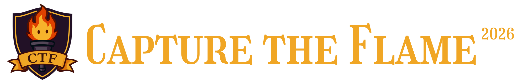

---

**Welcome** to the challenge library of the **Capture the Flame 2026** competition. With a major emphasis on accessibility and education for cyber security concepts these challenges were made diligently by our team to ensure a fun and educational experience for the competitors! 

## Events

Challenges were made in the preparation for the following events:  
[**Hack-O-Ween**](https://github.com/edmuri/Hack-O-Ween)  🎃  
[**Caught the LoveBug**](https://github.com/Capture-The-Flame/Caught_The_Lovebug_2026) 🩷   
[**Ignite the Flame**](https://github.com/Capture-The-Flame/Ignite_The_Flame_2026)💥  
[**Into the Flame**](https://github.com/Capture-The-Flame/Into_The_Flame_2026) 🔍  
[**Byte the Flame**](https://github.com/Capture-The-Flame/Byte_The_Flame_2026) ❤️‍🔥  
**Capture the Flame** 🔥  

## Categories

A full composite list of the categories we created challenges for are as follows: 

**AI**  
**Binary Exploit**  
**Cryptography**  
**Forensics**  
**Networking**  
**OSINT**  
**Reverse Engineering**  
**Web Exploit**  

The repo has the following structure

<pre> Category/ 
        ├── Challenge/ 
            ├── assets/ 
            |   ├── < Challenge File >
            |   └── toMake/
            |       └── Files to make challenges
            └── < Challenge Write-up >
</pre>

**Note** - Not all challenges require a file for code thus not all have the assets folder

## Contributors

### Experience Team

  
<b>Eduardo Murillo</b> – Team Lead

  &nbsp;&nbsp;&nbsp;&nbsp;
  LinkedIn: 
  <a href="https://www.linkedin.com/in/eduardo-murillo1" style=" text-decoration: none;">
    Here
  </a>
  &nbsp;&nbsp;&nbsp;&nbsp;
  Github:
  <a href="https://github.com/edmuri" style="text-decoration: none;">
    Here
  </a>

  
<strong>Coda Richmond</strong> – Event Director

    &nbsp;&nbsp;&nbsp;&nbsp;
  LinkedIn: 
  <a href="https://www.linkedin.com/in/coda-richmond/" style=" text-decoration: none;">
    Here
  </a>
  &nbsp;&nbsp;&nbsp;&nbsp;
  Github:
  <a href="https://github.com/thecoda666" style="text-decoration: none;">
    Here
  </a>

  
Fatima Mora – Event Director

    &nbsp;&nbsp;&nbsp;&nbsp;
  LinkedIn: 
  <a href="https://www.linkedin.com/in/fatima-mora-garcia/" style=" text-decoration: none;">
    Here
  </a>
  &nbsp;&nbsp;&nbsp;&nbsp;
  Github:
  <a href="https://github.com/fmora22" style="text-decoration: none;">
    Here
  </a>

  
Aleena Mehmood

    &nbsp;&nbsp;&nbsp;&nbsp;
  LinkedIn: 
  <a href="https://www.linkedin.com/in/aleena-mehmood/" style=" text-decoration: none;">
    Here
  </a>
  &nbsp;&nbsp;&nbsp;&nbsp;
  Github:
  <a href="https://github.com/amehm" style="text-decoration: none;">
    Here
  </a>

  
Ammani Khan

    &nbsp;&nbsp;&nbsp;&nbsp;
  LinkedIn: 
  <a href="https://www.linkedin.com/in/ammanikhan" style=" text-decoration: none;">
    Here
  </a>
  &nbsp;&nbsp;&nbsp;&nbsp;
  Github:
  <a href="https://github.com/ammanikhan" style="text-decoration: none;">
    Here
  </a>

  
Anirudh Yallapragada

      &nbsp;&nbsp;&nbsp;&nbsp;
  LinkedIn: 
  <a href="https://www.linkedin.com/in/ayswe/" style=" text-decoration: none;">
    Here
  </a>
  &nbsp;&nbsp;&nbsp;&nbsp;
  Github:
  <a href="https://github.com/anirudh-56" style="text-decoration: none;">
    Here
  </a>

  
Basil Tiongson

      &nbsp;&nbsp;&nbsp;&nbsp;
  LinkedIn: 
  <a href="https://www.linkedin.com/in/basiltiongson/" style=" text-decoration: none;">
    Here
  </a>
  &nbsp;&nbsp;&nbsp;&nbsp;
  Github:
  <a href="https://github.com/basiltiongson0" style="text-decoration: none;">
    Here
  </a>

  
Claudia Varnas

        &nbsp;&nbsp;&nbsp;&nbsp;
  LinkedIn: 
  <a href="https://www.linkedin.com/in/claudia-varnas-84abb42b2/" style=" text-decoration: none;">
    Here
  </a>
  &nbsp;&nbsp;&nbsp;&nbsp;
  Github:
  <a href="https://github.com/cl-py" style="text-decoration: none;">
    Here
  </a>

  
Edoardo Gennaretti

        &nbsp;&nbsp;&nbsp;&nbsp;
  LinkedIn: 
  <a href="https://www.linkedin.com/in/edoardogennaretti/" style=" text-decoration: none;">
    Here
  </a>
  &nbsp;&nbsp;&nbsp;&nbsp;
  Github:
  <a href="https://github.com/edogenna" style="text-decoration: none;">
    Here
  </a>

  
Gauri Khanolkar

        &nbsp;&nbsp;&nbsp;&nbsp;
  LinkedIn: 
  <a href="https://www.linkedin.com/in/gauri-khanolkar/" style=" text-decoration: none;">
    Here
  </a>
  &nbsp;&nbsp;&nbsp;&nbsp;
  Github:
  <a href="https://github.com/Gauri-Khanolkar1" style="text-decoration: none;">
    Here
  </a>

  
Rose Torres

        &nbsp;&nbsp;&nbsp;&nbsp;
  LinkedIn: 
  <a href="https://www.linkedin.com/in/roselyn-torres/" style=" text-decoration: none;">
    Here
  </a>
  &nbsp;&nbsp;&nbsp;&nbsp;
  Github:
  <a href="https://github.com/roselyn818" style="text-decoration: none;">
    Here
  </a>

  
Saja Bushara

        &nbsp;&nbsp;&nbsp;&nbsp;
  LinkedIn: 
  <a href="https://www.linkedin.com/in/sajabushara/" style=" text-decoration: none;">
    Here
  </a>
  &nbsp;&nbsp;&nbsp;&nbsp;
  Github:
  <a href="https://github.com/supernova37452" style="text-decoration: none;">
    Here
  </a>

  
Sammy Patel

        &nbsp;&nbsp;&nbsp;&nbsp;
  LinkedIn: 
  <a href="https://www.linkedin.com/in/saumilpatel06//" style=" text-decoration: none;">
    Here
  </a>
  &nbsp;&nbsp;&nbsp;&nbsp;
  Github:
  <a href="https://github.com/sammypatel06" style="text-decoration: none;">
    Here
  </a>

  
Sufiyan Shariff

        &nbsp;&nbsp;&nbsp;&nbsp;
  LinkedIn: 
  <a href="https://www.linkedin.com/in/sufiyan-shariff-22354021a/" style=" text-decoration: none;">
    Here
  </a>
  &nbsp;&nbsp;&nbsp;&nbsp;
  Github:
  <a href="https://github.com/cluelessdesi" style="text-decoration: none;">
    Here
  </a>

  
Teresa Chirayil

        &nbsp;&nbsp;&nbsp;&nbsp;
  LinkedIn: 
  <a href="https://www.linkedin.com/in/teresachirayil/" style=" text-decoration: none;">
    Here
  </a>
  &nbsp;&nbsp;&nbsp;&nbsp;
  Github:
  <a href="https://github.com/TeresaChirayil" style="text-decoration: none;">
    Here
  </a>

  

### Experience++

  
Anar Enkhzol

  &nbsp;&nbsp;&nbsp;&nbsp;
  Github:
  <a href="https://github.com/Aukovein" style="text-decoration: none;">
    Here
  </a>

  
Derick Johnson

        &nbsp;&nbsp;&nbsp;&nbsp;
  LinkedIn: 
  <a href="https://www.linkedin.com/in/derick-m-johnson/" style=" text-decoration: none;">
    Here
  </a>

  
Gwendolyn Vongkasemsiri

  
Lily Gross

  &nbsp;&nbsp;&nbsp;&nbsp;
  Github:
  <a href="https://github.com/AppalachianMounta1n" style="text-decoration: none;">
    Here
  </a>

  
Nefeli Georgilas

  
J Benitez

  
Lei Chen

